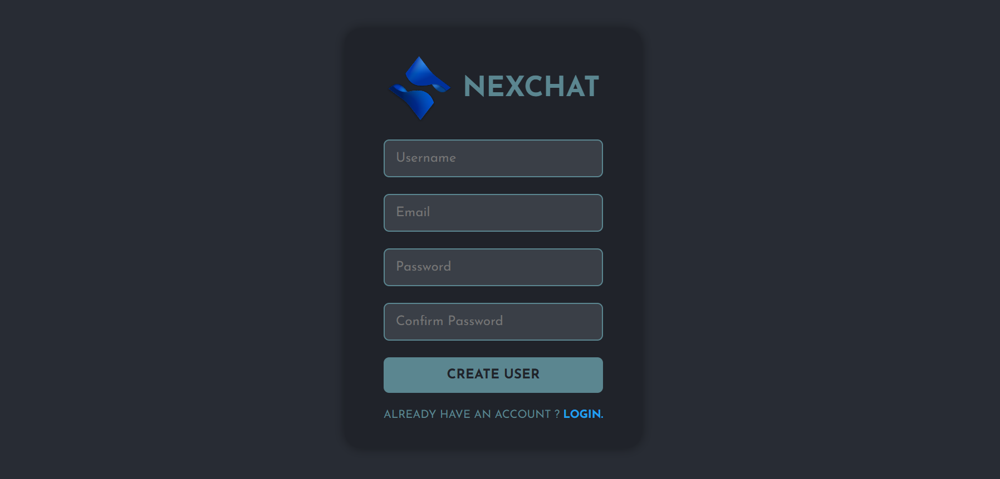
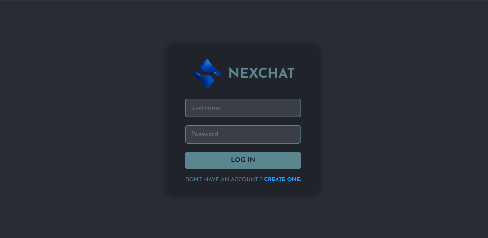
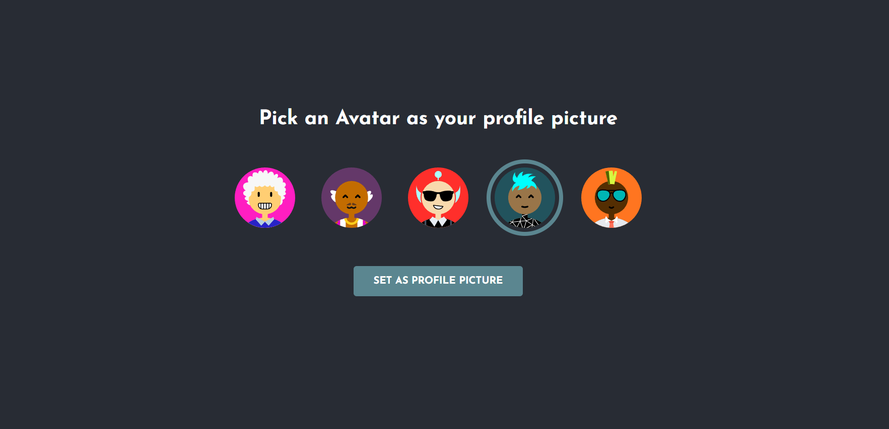
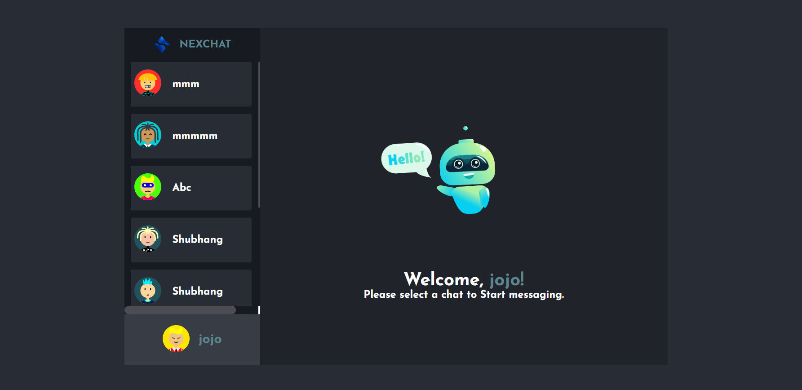
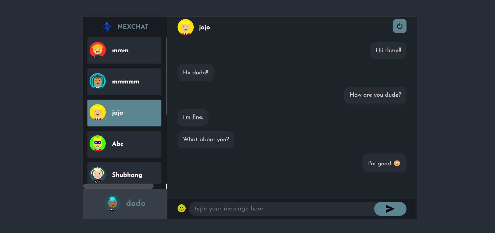

# NexChat

NexChat is a chatting application that provides a real-time communication using socket.io and it stores user's details and messages in an encrypted format using MongoDB database. It provides a features like user can set an avatar for their profile and emoji 
support along with messages enhancing user's experience

## Tech Stack

- **Client:** React JS
- **Server:** Node JS, Express JS, Socket.io
- **Database:** MongoDB

## Preview
### 1. Register Page

### 2. Login Page

### 3. SetAvatar Page

### 4. Welcome Page

### 5. Chatting Page


## Project Setup

1. Clone the repository:
```bash
git clone https://github.com/DivineKushaL/chat-app.git
cd chat-app
 ```
2. Install the necessary dependencies:
```bash
cd client
npm install
cd ../server
npm install
```

3. Configure environment variables. Copy `.env.example` to `.env` in both
   the `client` and `server` folders and update the URLs to match your
   deployment or testing environment.

4. Run the App

Navigate to server directory and start the server
```bash
cd server
npm start
```

Navigate to client directory and start the application
```bash
cd ../client
npm start
```

## License

This project is licensed under the MIT License. See the [LICENSE](LICENSE) file for details.

## Deployment

WeatherSphere is deployed using render and can be accessed at [NexChat](https://nexchat-1-1x8i.onrender.com).

